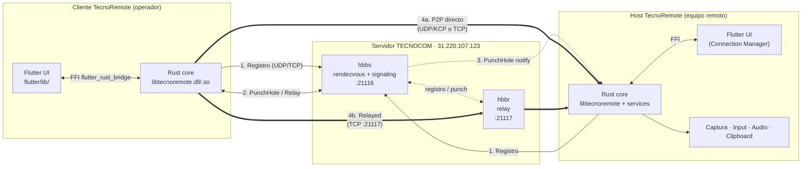
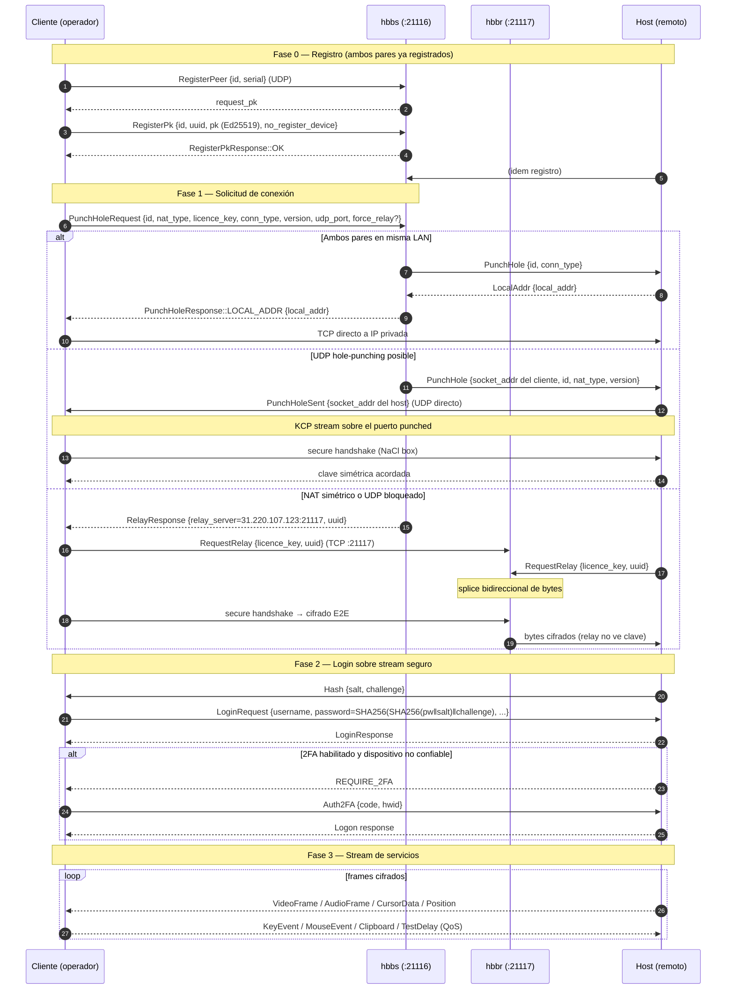
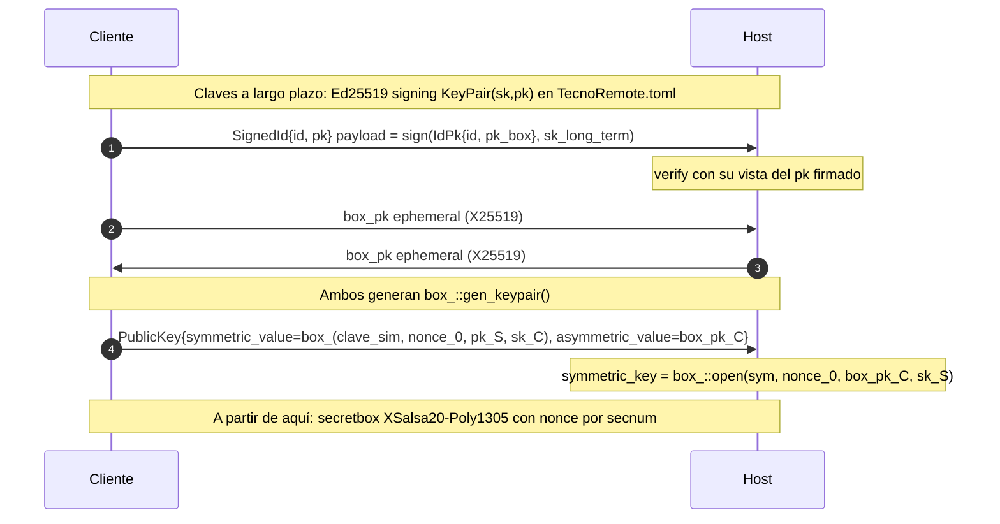
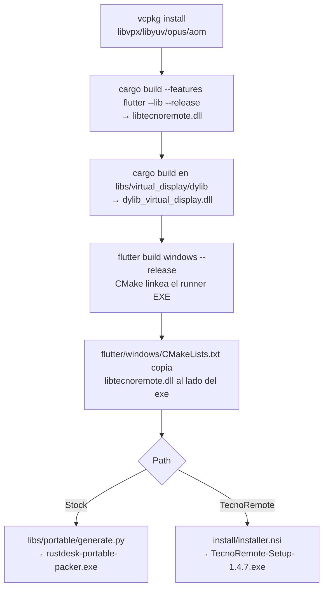

# TecnoRemote — Ficha Técnica

> Documento de referencia interna sobre arquitectura, protocolos, infraestructura y flujo del producto **TecnoRemote**, fork de RustDesk v1.4.7 mantenido por TECNOCOM.

| Campo | Valor |
|---|---|
| **Producto** | TecnoRemote — Soporte Remoto |
| **Empresa** | TECNOCOM |
| **Base** | Fork de [rustdesk/rustdesk](https://github.com/rustdesk/rustdesk) `v1.4.7` |
| **Crate** | `tecnoremote` (lib `libtecnoremote`, `cdylib + staticlib + rlib`) |
| **Versión actual** | `1.4.7` (`+65` build) |
| **Licencia** | AGPLv3 (uso interno TECNOCOM; distribución externa obliga a publicar fuente) |
| **MSRV** | Rust `1.75`, edition `2021` |
| **Repositorio** | `Dvl-Sant/tecnoremote` |
| **Soporte** | `soporte@tecnocom.com` |

---

## Tabla de contenidos

1. [Stack tecnológico](#1-stack-tecnológico)
2. [Arquitectura general](#2-arquitectura-general)
3. [Estructura de módulos](#3-estructura-de-módulos)
4. [Servicios del host](#4-servicios-del-host)
5. [Protocolos de red y puertos](#5-protocolos-de-red-y-puertos)
6. [Flujo de conexión extremo a extremo](#6-flujo-de-conexión-extremo-a-extremo)
7. [Rendezvous y NAT traversal](#7-rendezvous-y-nat-traversal)
8. [Cifrado y seguridad del transporte](#8-cifrado-y-seguridad-del-transporte)
9. [Autenticación y 2FA](#9-autenticación-y-2fa)
10. [Pipeline de video y audio](#10-pipeline-de-video-y-audio)
11. [Persistencia y configuración](#11-persistencia-y-configuración)
12. [Infraestructura TECNOCOM](#12-infraestructura-tecnocom)
13. [Build y packaging](#13-build-y-packaging)
14. [Personalización del fork](#14-personalización-del-fork)
15. [Glosario y referencias](#15-glosario-y-referencias)

---

## 1. Stack tecnológico

### Núcleo Rust
| Componente | Tecnología | Versión / Notas |
|---|---|---|
| Lenguaje | Rust | 1.75 MSRV, edition 2021 |
| Runtime async | Tokio | full features, sin nested runtimes |
| Bridge UI | `flutter_rust_bridge` | `=1.80` |
| Serialización | `protobuf` | 3.7, mensajes en `libs/hbb_common/protos/` |
| Cifrado | `sodiumoxide` | 0.2 (NaCl: Ed25519, X25519, XSalsa20-Poly1305) |
| TLS opcional | `tokio-rustls` + `rustls-platform-verifier` | 0.26 |
| WebSockets | `tokio-tungstenite` | 0.26 |
| Codec vídeo SW | `libvpx` (VP8/VP9), `libaom` (AV1) | vía vcpkg `x64-windows-static` |
| Codec vídeo HW | NVENC / QSV / AMF / VAAPI / VideoToolbox / MediaCodec | feature `hwcodec` |
| Codec audio | `magnum-opus` (Opus) | fork rustdesk-org |
| Captura de pantalla | `libs/scrap` | DXGI (Win), X11/Wayland-PipeWire (Linux), Quartz (macOS), NDK (Android) |
| Inyección de input | `libs/enigo` + `rdev` | multiplataforma |
| Clipboard archivos | `libs/clipboard` | `fuser` (Linux), `cacao` (macOS), `arboard` (texto) |
| KCP sobre UDP | `kcp-sys` | transporte confiable sobre UDP crudo |
| Configuración | `confy` (fork) + TOML | `TecnoRemote.toml`, `TecnoRemote2.toml` |
| HTTP client | `reqwest` 0.12 | TLS rustls + native-tls |
| 2FA | `totp-rs` 5.4 | SHA1, 6 dígitos, 30s |

### UI Flutter
| Componente | Versión |
|---|---|
| Flutter SDK | `^3.1.0` (CI pin 3.24.5) |
| `flutter_rust_bridge` | `1.80.1` |
| State management | `provider ^6.0.5` + `get ^4.6.5` |
| Terminal embebido | `xterm 4.0.0` |
| DB local | `sqflite 2.2.0` |
| QR | `qr_flutter` + `zxing2` |
| Forks rustdesk-org | `window_manager`, `desktop_multi_window`, `texture_rgba_renderer`, `flutter_gpu_texture_renderer`, `dynamic_layouts`, `uni_links`, `dash_chat_2` |

### Plataformas soportadas
Windows (10+, x64), Linux (X11/Wayland), macOS (10.14+), Android, iOS, Web (canal `web/`).

---

## 2. Arquitectura general

TecnoRemote sigue una arquitectura de **cliente-host** con **servidor de señalización (rendezvous) y relay** desplegado por TECNOCOM. Cada binario es simultáneamente cliente y host.



**Principios clave:**
- **Sin servidor central de datos**: el stream viaja P2P cuando es posible; el relay solo retransmite bytes cifrados.
- **Cifrado extremo a extremo**: el relay nunca ve la clave simétrica; solo participan los dos extremos.
- **Núcleo Rust único** para desktop, Android, iOS (vía `flutter_rust_bridge`). Web usa sustituciones en `flutter/lib/web/`.
- **Configuración declarativa**: el fork hardcodea servidor, key y contraseña en `OVERWRITE_SETTINGS` (ver [§14](#14-personalización-del-fork)).

---

## 3. Estructura de módulos

### Rust (`src/`)
| Ruta | Rol |
|---|---|
| `main.rs` | Entry point con 3 `cfg` gates: Android/Flutter (cdylib), CLI (`--connect`, `--server`, `--port-forward`), Desktop Sciter (deprecado) |
| `core_main.rs` | Bucle principal de UI legacy |
| `lib.rs` | Declara módulos: `auth_2fa`, `custom_server`, `hbbs_http`, `privacy_mode`, `kcp_stream`, `whiteboard`, `updater`, `tray`, `virtual_display_manager` (Win) |
| `client.rs` + `client/` | Conexión saliente: `Client::start`, handshake, login, `io_loop` |
| `server.rs` + `server/` | Conexión entrante: `Server`, registry de servicios, `create_tcp_connection` |
| `rendezvous_mediator.rs` | Comunicación con hbbs: registro, hole-punching, relay, NAT test |
| `flutter_ffi.rs` | Source del FFI bridge → genera `flutter/lib/generated_bridge.dart` |
| `flutter.rs`, `flutter_pty.rs` | Integración Flutter desktop/terminal |
| `common.rs` | Utilidades: `init_tecnocom_defaults()`, `is_tecnoremote()`, `get_app_name()` |
| `auth_2fa.rs` | TOTP + entrega por Telegram |
| `custom_server.rs` | Parseo de licencia firmada (Ed25519) embebida en el nombre del binario |
| `hbbs_http.rs` + `hbbs_http/` | Cliente HTTP del backend TecnoRemote (sync, records, downloader) |
| `codec.rs` | Wrappers de codecs de `libs/scrap/common/codec.rs` |
| `lang.rs` + `lang/` | 51 locales, sustitución runtime de "RustDesk"→app name |
| `platform/` | Por OS: `windows.rs` (4 328 L), `linux.rs` (2 130 L), `macos.rs` (1 139 L) + siblings C++/Obj-C |

### Librerías del workspace (`libs/`)
| Lib | Propósito |
|---|---|
| `hbb_common` | **Fundación**: protobuf gen, config TOML, `Stream` (TCP/UDP/WS/WebRTC), cifrado, fs transfer, logging, password security, fingerprint |
| `scrap` | Captura de pantalla + codec (encoder/decoder). Subdirs `dxgi/`, `x11/`, `wayland/`, `quartz/`, `android/` |
| `enigo` | Inyección de teclado/ratón multiplataforma |
| `clipboard` | Copiar/pegar de **archivos** entre pares (FUSE en Linux, NSFilePromiseProvider en macOS) |
| `virtual_display` (+ `dylib`) | Driver de display virtual Windows (RustDesk IDD o Amyuni) |
| `remote_printer` | Redirección de impresora remota Windows |
| `portable` | Packer para servicio portable Windows |
| `libxdo-sys-stub` | Stub `[patch.crates-io]` para compilar en sistemas sin libxdo (Wayland-only) |

### Flutter (`flutter/lib/`)
| Carpeta | Contenido |
|---|---|
| `desktop/` | Páginas multi-ventana: home, settings, tab_page, remote, file_manager, port_forward, terminal, server, install (Win), view_camera + `screen/` + `widgets/` |
| `mobile/` | Páginas táctiles: home, scan (QR), settings, remote, file_manager, server, terminal, view_camera + widgets (`deploy_dialog`, `gesture_help`, `floating_mouse`) |
| `models/` | 21 modelos de estado (state mgmt): `native_model` (FFI loader), `input_model`, `file_model`, `chat_model`, `server_model`, `peer_tab_model`, `platform_model`, `terminal_model`, `desktop_render_texture`, etc. |
| `native/` | Wrappers de canales nativos (`common.dart`, `custom_cursor.dart`, `win32.dart`) |
| `plugin/` | Framework de plugins (manager, event, handlers, ui_manager) |
| `utils/` | `event_loop.dart`, `multi_window_manager.dart`, `http_service.dart`, `platform_channel.dart` |
| `web/` | Shims para web target (`bridge.dart`, `dummy.dart`, `texture_rgba_renderer.dart`) |
| raíz | `main.dart`, `common.dart`, `consts.dart`, **`generated_bridge.dart`** (13 882 L, autogenerado) |

> **Nota**: el nombre del paquete Dart sigue siendo `flutter_hbb`. El branding se aplica en runtime vía `APP_NAME` y strings nativas.

---

## 4. Servicios del host

El host (`src/server.rs`) mantiene `connections: HashMap<i32, ConnInner>` y `services: HashMap<String, Box<dyn Service>>`. Cada conexión se suscribe (pub/sub vía `Subscriber`) a los servicios que necesita.

| Servicio | Archivo | Rol |
|---|---|---|
| **video_service** | `server/video_service.rs` (1 419 L) | Bucle de captura por monitor. Usa `scrap::Capturer`, alimenta un `Encoder`, emite `VideoFrame`. Soporta `Monitor` y `Camera`. Backpressure vía `FRAME_FETCHED_NOTIFIERS` |
| **video_qos** | `server/video_qos.rs` | `VideoQoS`: ajusta fps/bitrate según `TestDelay` por usuario y calidad configurada. Sube fps con latencia baja, baja calidad al pasar 150ms |
| **audio_service** | `server/audio_service.rs` (527 L) | Captura loopback: WASAPI (Win), CoreAudio (mac), PulseAudio (Linux). Codifica Opus 48kHz stereo, chunks de 10ms (`AUDIO_DATA_SIZE_U8 = 960*4`) |
| **input_service** | `server/input_service.rs` (2 257 L) | Recibe `KeyEvent`/`MouseEvent`/`PointerDeviceEvent`, inyecta vía `enigo`/`uinput`. Modos de teclado: Legacy/Map/Translate/Auto |
| **clipboard_service** | `server/clipboard_service.rs` | Suscripción al clipboard del SO, envía `MultiClipboards`. Variante `FILE_NAME` para copiar/pegar archivos |
| **display_service** | `server/display_service.rs` | Enumeración de displays, cambios de resolución, multi-monitor |
| **terminal_service** | `server/terminal_service.rs` (1 956 L) | Shell interactivo vía `portable_pty`. Reconectable por `Terminal{service_id}` |
| **portable_service** | `server/portable_service.rs` (Win) | Host como servicio impersonando SYSTEM vía `impersonate-system` |
| **printer_service** | `server/printer_service.rs` (Win) | Redirección de impresora remota vía `libs/remote_printer` |
| **rdp_input** / **uinput** | `server/rdp_input.rs`, `server/uinput.rs` (Linux) | Input estilo RDP / dispositivo `uinput` kernel para Wayland |
| **login_failure_check** | `server/login_failure_check.rs` | Throttling anti-fuerza bruta por peer |

`Server::new()` construye el `CLIENT_SERVER` global y registra los servicios activos según plataforma y features.

---

## 5. Protocolos de red y puertos

### Protocolos de transporte
| Protocolo | Uso | Notas |
|---|---|---|
| **UDP** | Default para señalización y P2P | Hole-punching + KCP (confiable, ordenado) |
| **TCP** | Fallback P2P, relay, WS upgrade | Cuando UDP falla o NAT simétrico |
| **WebSocket** | Entornos restringidos / proxy | Puertos 21118/21119 |
| **TLS** (`tokio-rustls`) | Cuando hay `key`+`token` (auth API) | Wrapping del socket rendezvous |
| **QUIC/WebRTC** | Experimental (`webrtc` feature) | Variante `WebRTCStream` en `Stream` enum |

### Puertos del servidor TECNOCOM
| Puerto | Protocolo | Servicio | Propósito |
|---|---|---|---|
| **21115** | UDP | hbbs | NAT type test |
| **21116** | UDP + TCP | hbbs | Rendezvous (señalización, registro, hole-punch) |
| **21117** | TCP | hbbr | Relay (datos cifrados retransmitidos) |
| **21118** | TCP | hbbs | WebSocket rendezvous (entornos bloqueados) |
| **21119** | TCP | hbbr | WebSocket relay |

Constantes en `libs/hbb_common/src/config.rs:123-126`:
```
RENDEZVOUS_PORT   = 21116
RELAY_PORT        = 21117
WS_RENDEZVOUS_PORT = 21118
WS_RELAY_PORT     = 21119
```

### Framing
Todos los streams TCP/WS usan `BytesCodec` (`libs/hbb_common/src/bytes_codec.rs`):
- Long-prefixed framing; los 2 bits bajos del byte 0 indican ancho del header (1–4 bytes).
- Tamaño máximo de payload: `0x3FFFFFFF` (~1 GB).
- Pre-asignación acotada a **256 KB** para mitigar ataques de header-spoofing.

### Timeouts
| Constante | Valor |
|---|---|
| `CONNECT_TIMEOUT` | 18 s |
| `RENDEZVOUS_TIMEOUT` | 12 s |
| `REG_INTERVAL` | 15 s |
| Intentos de `PunchHole` | 3 con timeout progresivo `i*3000ms` |

---

## 6. Flujo de conexión extremo a extremo



### Tipos de conexión (`rendezvous.proto:9-16`)
`DEFAULT_CONN` (escritorio) · `FILE_TRANSFER` · `PORT_FORWARD` · `RDP` · `VIEW_CAMERA` · `TERMINAL`

---

## 7. Rendezvous y NAT traversal

Implementado en `src/rendezvous_mediator.rs`. Orquestador: `start_all()` (l. 106).

### Registro de par
1. Test de tipo de NAT (UDP).
2. `start_all()` arranca: `hbbs_http::sync`, `direct_server`, listener LAN, y `join_all` de todos los rendezvous servers (fan-out multi-server, l. 173).
3. Cada servidor: `start()` (l. 471) elige transporte — WS/proxy/sin-UDP → `start_tcp`; si no → `start_udp`.
4. `register_peer` envía `RegisterPeer{id, serial}` (l. 819).
5. Si el server pide PK → `RegisterPk{id, uuid, pk, no_register_device}` (l. 771). El PK es **Ed25519 signing** de `Config::get_key_pair()`.
6. Respuesta `RegisterPkResponse`: `OK`, `UUID_MISMATCH` (re-registra), o **`NOT_DEPLOYED`** (fork-specific).

> **Caso `NOT_DEPLOYED`** (específico del fork): activa flag `NEEDS_DEPLOY`, throttle de 30s, y solicita al operador ejecutar `tecnoremote --deploy --token <api_token>` para registrar el dispositivo contra el backend TECNOCOM.

### Tipos de NAT y decisión de transporte
| NAT combinado | Acción |
|---|---|
| Ambos pares no simétricos, UDP abierto | **UDP hole-punching + KCP** (`punch_udp_hole`, l. 720; `KcpStream::accept`) |
| Al menos uno simétrico, o WS/proxy, o TCP listen deshabilitado sin UDP | **Relay directo** (`create_relay`, l. 507) |
| Ambos en misma LAN | **Intranet shortcut** (`handle_intranet`, l. 556): server manda `FetchLocalAddr`, el par responde `LocalAddr{local_addr}`, conexión TCP a IP privada sin relay |

### `AddrMangle` — anti-NAT rewriting
`libs/hbb_common/src/lib.rs:142-200`: las IPs de socket intercambiadas vía rendezvous se ofuscan con **XOR contra un timestamp de microsegundos**, para que los middleboxes NAT no reconozcan y reescriban sus propias direcciones de pool dentro del payload.

### Métricas y resiliencia
- Latencia EMA sobre round-trips de registro (l. 229-255), persistida por host (`Config::update_latency`).
- `CheckIfResendPk` (l. 1002): drop guard que re-setea `key_confirmed=false` si el PK cambia tras sync de config — resuelve la race root↔user-config.

---

## 8. Cifrado y seguridad del transporte

Dos capas: **handshake** (acuerdo de clave) + **cifrado per-frame** del stream.



### Capa 1 — Handshake (`src/server.rs:190` `create_tcp_connection`)
1. Cada lado tiene par **Ed25519 signing** (`sign::gen_keypair`, `config.rs:1129`) en `KeyPair(sk, pk)`.
2. El host envía `SignedId{id, pk}` donde el payload está firmado con la clave de firma a largo plazo.
3. Ambos generan par efímero **NaCl box_ (X25519)** (`box_::gen_keypair`).
4. El cliente sella una clave simétrica aleatoria con `box_`, envía `PublicKey{symmetric_value, asymmetric_value=box_pk}`.
5. `Encrypt::decode` (`tcp.rs:323`) abre la clave simétrica con `box_::open(sym, nonce_zero, their_box_pk, our_box_sk)`.

### Capa 2 — Cifrado del stream (`libs/hbb_common/src/tcp.rs`, `Encrypt` l. 28)
| Aspecto | Valor |
|---|---|
| Algoritmo | `sodiumoxide::crypto::secretbox` (XSalsa20-Poly1305) |
| Clave | 32 bytes acordada en el handshake |
| Nonce | Counter little-endian en los primeros 8 bytes (`get_nonce(seqnum)`, l. 203) |
| Contadores | Separados para send/recv (`self.1`, `self.2`) |
| Cobertura | Todo `send_raw` → `key.enc(msg)`; todo `next` → `key.dec(bytes)` |

### TLS opcional (`secure_tcp`)
Cuando `key`+`token` están presentes (auth basada en API/token), el socket TCP rendezvous se envuelve en TLS con `tokio-rustls` y `rustls-platform-verifier`.

### Cifrado en reposo (`libs/hbb_common/src/password_security.rs`)
- Prefijo de versión `"00"` + base64.
- `symmetric_crypt` (l. 212): `secretbox` con clave derivada de `get_uuid()` (machine UID, fallback a signing PK).
- Formato: `1 || nonce(24B) || ciphertext`. Format legacy usa nonce cero (`open_secretbox_payload` prueba ambos).
- **Aplica a**: contraseña socks5, unlock PIN, secreto 2FA, token del bot de Telegram, contraseña permanente.

---

## 9. Autenticación y 2FA

### Fuentes de contraseña (`password_security.rs`)
| Tipo | Descripción |
|---|---|
| **Temporal** | Rotativa, 6/8/10 dígitos. Alfanumérica (`get_auto_password`) o numérica one-time (`get_auto_numeric_password`, gated por `OPTION_ALLOW_NUMERNIC_ONE_TIME_PASSWORD`) |
| **Permanente** | Encriptada en config. En TecnoRemote **hardcodeada a `Tecnocom2026`** |

**Método de verificación** (`verification_method`): `use-temporary-password` · `use-permanent-password` · ambos (default).
**Modo de aprobación** (`approve_mode`): `password` · `click` · `both`.

### Challenge-response de login (`src/server/connection.rs`)
1. Host genera `Hash{salt, challenge}` (l. 419):
   - `salt` = `Config::get_effective_permanent_password_salt()`
   - `challenge` = `Config::get_auto_password(6)`
2. Cliente computa `h1 = SHA256(password ‖ salt)` y envía `SHA256(h1 ‖ challenge)` como `LoginRequest.password`.
3. Host valida (`verify_h1`, l. 2078) con `validate_password_plain` / `validate_password_storage` / `validate_preset_password_storage`.
4. **`constant_time_eq`** (l. 2086) para prevenir timing leaks.
5. Brute-force: `MAX_CONSECUTIVE_FAILURES = 10` antes de throttling (l. 2131).

### 2FA — TOTP + Telegram (`src/auth_2fa.rs`, 204 L)
| Parámetro | Valor |
|---|---|
| Algoritmo | SHA1 |
| Dígitos | 6 |
| Step | 30 s |
| Issuer | `"TecnoRemote"` |
| Account label | `"Connection"` |

**Flujo:**
1. `generate2fa()` produce URL `otpauth://` para enrolamiento por QR.
2. `verify2fa(code)` valida y persiste. Secreto encriptado en reposo (`encrypt_vec_or_original(.., "00", 1024)`, JSON en opción `"2fa"`).
3. En login (`connection.rs:277,454`), tras contraseña exitosa, `send_logon_response_and_keep_alive` (l. 1502) si 2FA requerido y dispositivo no es trusted → devuelve `REQUIRE_2FA` y mantiene viva la conexión.
4. Cliente envía `Auth2FA{code, hwid}` (`message.proto:97`).
5. Host valida con `totp.check_current(code)` (l. 2618). Si OK, limpia `require_2fa` y opcionalmente añade `hwid` a `TrustedDevice` (l. 2632) — logins siguientes saltan 2FA.

**Entrega alternativa por Telegram** (`auth_2fa.rs:158`): si `TelegramBot{token, chat_id}` configurado (también encriptado en reposo), el host hace POST a `https://api.telegram.org/bot…/sendMessage` con el código y la IP de origen, en lugar de pedir TOTP app.

### Mensajes de login (`client.rs:114-119`)
`LOGIN_MSG_PASSWORD_EMPTY` · `LOGIN_MSG_PASSWORD_WRONG` · `LOGIN_MSG_2FA_WRONG` · `REQUIRE_2FA = "2FA Required"`.

---

## 10. Pipeline de video y audio

### Codecs soportados (`VideoFrame` oneof, `message.proto:25-36`)
SW: `vp9s`, `vp8s`, `av1s`, `rgb`, `yuv`
HW: `h264s`, `h265s` (NVENC/QSV/AMF/VAAPI/VideoToolbox/MediaCodec)

### Encoder configs (`libs/scrap/src/common/codec.rs:50-58`)
```rust
EncoderCfg::VPX(VpxEncoderConfig)     // VP8 o VP9 vía libvpx
EncoderCfg::AOM(AomEncoderConfig)     // AV1 vía libaom
EncoderCfg::HWRAM(HwRamEncoderConfig) // feature "hwcodec" (NVENC/QSV/AMF/VAAPI)
EncoderCfg::VRAM(VRamEncoderConfig)   // feature "vram" (D3D11 texture Windows)
```

### Negociación (`Encoder::update`, l. 171)
1. Los pares intercambian `SupportedDecoding{ability_vp8, ability_vp9, ability_av1, ability_h264, ability_h265, prefer, prefer_chroma, i444}`.
2. El encoder agrega las abilities de todos los peers, elige el `prefer` más frecuente.
3. Fallback automático por prioridad: **h265 > h264 > av1/vp9/vp8**.
4. VP8 se auto-selecciona en sistemas con ≤ 4 GB RAM (l. 287).
5. I444 chroma para VP9/AV1 solo si todos los pares opt-in.

### Validación AV1 en runtime (`test_av1`, l. 1040)
Al arrancar, codifica 10 frames falsos 1080p. Si key-frame > 90ms o non-key > 30ms, marca AV1 inutilizable (`OPTION_AV1_TEST = "N"`). Deshabilitado en 32-bit (`disable_av1`, l. 1033).

### Bitrate y calidad
- `base_bitrate` (l. 929): tabla desde VGA/400kbps hasta 8K/12Mbps, escalada lineal por pixels.
- Presets (`BR_BEST=1.5`, `BR_BALANCED=0.67`, `BR_SPEED=0.5`).
- `codec_thread_num` (l. 973): CPU load + RAM, clampeado a `{1,2,4,8,16,32,64}`.

### Pipeline de captura (host)

```mermaid
flowchart LR
    A[display_service<br/>enumera monitores] --> B[video_service::new<br/>Monitor, idx]
    B --> C[scrap::Capturer<br/>DXGI/X11/Wayland/Quartz]
    C --> D[libyuv convert<br/>ARGBToI420 etc.]
    D --> E[Encoder<br/>VPX/AOM/HWRAM/VRAM]
    E --> F[EncodedVideoFrames]
    F --> G[Message::VideoFrame]
    G --> H[VideoQoS<br/>throttle fps/bitrate]
    H --> I[Stream cifrado<br/>XSalsa20-Poly1305]
    I --> J[Cliente]
```


### Audio
- Captura loopback: WASAPI (Win), CoreAudio (mac), PulseAudio vía IPC `_pa` (Linux/Android).
- Codec: **Opus** (`magnum-opus`), 48kHz stereo, chunks de 10ms (`AUDIO_DATA_SIZE_U8 = 960*4`).
- El cliente decodifica y reproduce vía `cpal`.
- Soporta switch de dispositivo de input para voice-call.

---

## 11. Persistencia y configuración

Todo en TOML vía `confy` (fork). Lógica en `libs/hbb_common/src/config.rs` (4 016 L).

### Archivos por OS
| OS | Ruta |
|---|---|
| Windows | `%APPDATA%\TecnoRemote\` |
| macOS | `~/Library/Application Support/TecnoRemote/` (rewrite a `Preferences` vía patch) |
| Linux | `~/.config/TecnoRemote/` (root → home del usuario real vía `getent passwd`) |
| Android/iOS | `APP_DIR/TecnoRemote/` |

Permisos Unix: **0o600** (`store_path`, l. 577).

### Structs principales
| Struct | Archivo | Contenido |
|---|---|---|
| `Config` | `TecnoRemote.toml` | `id`, `enc_id`, `password`, `salt`, `key_pair: KeyPair(sk,pk)`, `key_confirmed`, `keys_confirmed: HashMap<host,bool>` |
| `Config2` | `TecnoRemote2.toml` | `rendezvous_server`, `nat_type`, `serial`, `unlock_pin`, `trusted_devices`, `socks: Option<Socks5Server>`, `options: HashMap<String,String>` |
| `PeerConfig` | `TecnoRemote/<peer-id>.toml` | password por par, view style, image quality, codec preference, keyboard mode, view-only, port forwards, custom resolutions, `ui_flutter`, `info`, `transfer` |
| `LocalConfig` | (varios) | `LocalConfig` (l. 2128) |

### IPC sockets (`Config::ipc_path`, l. 845)
| OS | Ruta |
|---|---|
| Windows | Named pipe `\\.\pipe\TecnoRemote\query` |
| Unix | `/tmp/TecnoRemote-{uid}/ipc` (servicio: `/tmp/TecnoRemote-service/`) |

### Logging
`flexi_logger` rotación diaria, retención 31 días:
- macOS: `~/Library/Logs/TecnoRemote`
- Linux: `~/.local/share/logs/TecnoRemote`
- Windows: `%CONFIG%/log`

---

## 12. Infraestructura TECNOCOM

| Recurso | Valor |
|---|---|
| **Servidor** | `31.220.107.123` (Hostinger) |
| **Orquestación** | Dokploy |
| **Componentes** | `hbbs` (rendezvous + signaling) + `hbbr` (relay) |
| **Puertos abiertos** | `21115/udp`, `21116/tcp+udp`, `21117/tcp`, `21118/tcp`, `21119/tcp` |
| **RS_PUB_KEY** | `4VlBtYxNw5oCVBZhG9M1sDi2PzWhJo5zjgm3cwNlXXc=` (base64) |
| **Contraseña default** | `Tecnocom2026` |
| **Registro de dispositivos** | Vía `tecnoremote --deploy --token <api_token>` (gated por `NOT_DEPLOYED` en hbbs) |
| **Scripts de despliegue** | Repositorio separado `TecnoRemote-Deploy`: `instalar-tecnoremote.bat/.ps1` (Windows, testeados), `.sh` (Linux/macOS, sin testear) |
| **Config prebuilt** | `RustDesk2.toml` listo para distribución |

Hardcoded en el binario por `init_tecnocom_defaults()` (`src/common.rs:2107-2126`):

```rust
let server = "31.220.107.123";
let key    = "4VlBtYxNw5oCVBZhG9M1sDi2PzWhJo5zjgm3cwNlXXc=";
// OVERWRITE_SETTINGS: custom-rendezvous-server, relay-server, key
hard.insert("password", "Tecnocom2026");
builtin.insert(OPTION_HIDE_NETWORK_SETTINGS, "Y");  // oculta pestaña Network
```

Constantes espejo en `libs/hbb_common/src/config.rs:120-121`.

---

## 13. Build y packaging

### Toolchain de build
| Tool | Versión |
|---|---|
| Rust | 1.75 (CI mac: 1.81) |
| Flutter | 3.24.5 |
| vcpkg | checkout `2023.04.15` |
| Deps vcpkg (Windows) | `libvpx:x64-windows-static`, `libyuv:x64-windows-static`, `opus:x64-windows-static`, `aom:x64-windows-static` |

### Flujo Windows (end-to-end)


> **Carga del core**: el runner Flutter (`flutter/windows/runner/main.cpp:25`) hace `LoadLibraryA("libtecnoremote.dll")` al iniciar — el núcleo Rust es una DLL cargada por el exe Flutter, no link estático.

### Features del crate (`Cargo.toml:23-43`)
| Feature | Descripción |
|---|---|
| `flutter` (default off) | Habilita `flutter_rust_bridge` (build moderno) |
| `hwcodec` | Codecs hardware (NVENC/QSV/AMF/VAAPI) |
| `vram` | D3D11 texture VRAM encoder (Windows) |
| `mediacodec` | Android MediaCodec |
| `inline` | Sciter UI embebida (legacy) |
| `cli` | Modo CLI (`--connect`, `--server`, `--port-forward`) |
| `screencapturekit` | macOS ScreenCaptureKit |
| `unix-file-copy-paste` | Clipboard archivos en Linux |
| `plugin_framework` | Soporte de plugins |
| `use_dasp` (default) | Resampling audio con `dasp` |

### Perfil release (`Cargo.toml:241-247`)
```toml
lto = true
codegen-units = 1
panic = 'abort'
strip = true
rpath = true
```

### Packaging
| Target | Path / Herramienta |
|---|---|
| **Windows NSIS** | `install/installer.nsi` — TecnoRemote-branded, español+inglés, auto-start Run key, `--install-service`, x64-only gate |
| **Windows MSI** | `res/msi/` (WiX: `Package.wxs`, `CustomActions/` FirewallRules/RemotePrinter/ServiceUtils) |
| **Windows portable** | `libs/portable/generate.py` |
| **Linux .deb** | `res/DEBIAN/` (postinst/prerm/preinst/postrm) |
| **Linux .rpm** | `res/rpm.spec`, `rpm-flutter.spec`, `rpm-suse.spec`, `rpm-flutter-suse.spec` |
| **Arch** | `res/PKGBUILD` |
| **AppImage** | `appimage/AppImageBuilder-x86_64.yml`, `-aarch64.yml` |
| **Flatpak** | `flatpak/` (IDs aún `com.rustdesk.RustDesk`) |
| **macOS** | `res/osx-dist.sh` + bundle metadata |
| **Android** | Fastlane + F-Droid patches (`res/fdroid/patches/`) |
| **iOS** | `flutter/ios/Runner/Info.plist` |

### CI/CD (`.github/workflows/`)
| Workflow | Propósito |
|---|---|
| `flutter-build.yml` | Build reusable para todas las plataformas |
| `ci.yml` | CI en PR/push a master |
| `bridge.yml` | Regenera `generated_bridge.dart` (FRB 1.80.1, Flutter 3.22.3) |
| `flutter-tag.yml` | Publish on tag push |
| `flutter-nightly.yml` | Nightly builds |
| `fdroid.yml` | Pipeline F-Droid |
| `wf-cliprdr-ci.yml` | Tests C del clipboard Windows |
| `playground.yml` | Builds experimentales |
| `third-party-RustDeskTempTopMostWindow.yml` | Helper DLL Windows top-most |
| `clear-cache.yml` | Cache cleanup |

### Docker (`Dockerfile` + `entrypoint.sh`)
`debian:bullseye-slim`, instala deps GTK/X11/PulseAudio/GStreamer/PAM, construye CMake 3.30.6, vcpkg 2023.04.15 con libvpx/libyuv/opus/aom, drops `libsciter-gtk.so`, rustup, y corre `VCPKG_ROOT=/vcpkg cargo build --locked`.

### Tests
- **Único test suite**: `tests/test_invariant_wf_cliprdr.c` (92 L), framework **libcheck**, valida `wf_cliprdr_file_group_descriptor_size_valid()` (clipboard Windows).
- Sin tests Dart/Flutter ni harness Rust más allá de `#[cfg(test)]` inline.
- `dev-dependencies`: `hound` (audio), `docopt`.

---

## 14. Personalización del fork

### Hardcoding (Fase 3 del PLAN-IMPLEMENTACION.md)
| Setting | Valor | Ubicación |
|---|---|---|
| Rendezvous server | `31.220.107.123` | `src/common.rs:2108`, `config.rs:120` |
| Relay server | `31.220.107.123` | `src/common.rs:2113-2117` |
| RS_PUB_KEY | `4VlBtYxNw5oCVBZhG9M1sDi2PzWhJo5zjgm3cwNlXXc=` | `src/common.rs:2109`, `config.rs:121` |
| Permanent password | `Tecnocom2026` | `src/common.rs:2121` |
| Hide Network tab | `OPTION_HIDE_NETWORK_SETTINGS = "Y"` | `src/common.rs:2125` |

### Branding — mapa de archivos clave
| Archivo | Cambio |
|---|---|
| `libs/hbb_common/src/config.rs:72` | `APP_NAME = "TecnoRemote"` (master switch) |
| `src/common.rs:1009` | `is_tecnoremote()` (renamed de `is_rustdesk`) |
| `src/auth_2fa.rs:17` | `ISSUER = "TecnoRemote"` (TOTP) |
| `src/lang.rs:193` | Sustitución runtime `"RustDesk"` → app name |
| `Cargo.toml:2,4,7,12,215-219,234-236` | crate name, authors, description, winres, bundle id `com.tecnocom.tecnoremote` |
| `flutter/lib/models/native_model.dart:121-131` | Carga `libtecnoremote.so/.dll` |
| `flutter/lib/generated_bridge.dart:16` | `abstract class Tecnoremote` |
| `flutter/lib/common.dart:2384+` | Deep-link scheme `tecnoremote://` |
| `flutter/lib/desktop/widgets/tabbar_widget.dart:644` | Título window `"TecnoRemote"` |
| `flutter/windows/runner/main.cpp:25,28,66` | `LoadLibraryA("libtecnoremote.dll")`, título `L"TecnoRemote"` |
| `flutter/windows/runner/Runner.rc:92-98` | CompanyName `TECNOCOM`, FileDescription, LegalCopyright `© 2026 TECNOCOM`, OriginalFilename `tecnoremote.exe` |
| `flutter/android/app/src/main/AndroidManifest.xml` | `android:label="TecnoRemote"`, scheme `tecnoremote` |
| `flutter/ios/Runner/Info.plist` | Display name, bundle id `com.tecnocom.tecnoremote`, URL scheme `tecnoremote` |
| `flutter/macos/Runner/Configs/AppInfo.xcconfig` | `PRODUCT_NAME = TecnoRemote`, copyright `© 2026 TECNOCOM` |
| `res/tecnoremote.desktop` | Name, Exec, Icon, Comment, StartupWMClass |
| `res/tecnoremote-link.desktop` | URL handler `x-scheme-handler/tecnoremote` |
| `res/tecnoremote.service` | systemd unit `ExecStart=/usr/bin/tecnoremote --service` |
| `install/installer.nsi` | APP_NAME `TecnoRemote`, APP_PUBLISHER `TECNOCOM`, MUI español+inglés |

### Mecanismo `is_tecnoremote()`
`src/common.rs:1009-1011` define `is_tecnoremote()` que compara `APP_NAME.eq("TecnoRemote")`. Usado como toggle para branding condicional. Inversamente, `is_custom_client()` (l. 2306) devuelve `get_app_name() != "TecnoRemote"` — TecnoRemote se trata como baseline "no custom".

### Localización
51 idiomas en `src/lang/`. `translate_locale()` (`lang.rs:112`) dispatcha por locale. La sustitución runtime (l. 193) reescribe `"RustDesk"` por el app name en strings traducidos — excepto `upgrade_rustdesk_server_pro_*` y `powered_by_me`.

### Caveats conocidos
1. `build.py` no está rebrandeado: todavía usa `hbb_name = 'rustdesk'`, `exe_path = target/release/rustdesk(.exe)`, y chequea `librustdesk.dll` (l. 437). El flujo Windows-Flutter vía `build.py` está roto; usar `install/installer.nsi`.
2. Los paths Linux (`.deb`, RPM, PKGBUILD, Flatpak, AppImage) siguen emitiendo nombres `rustdesk`. Solo el installer NSIS Windows está totalmente brandeado.
3. `README.md` es el upstream sin modificar.
4. El paquete Dart sigue siendo `flutter_hbb`.
5. Coexisten `rustdesk.*` y `tecnoremote.*` en `res/` (no limpiado).
6. Hay un binario commiteado `install/TecnoRemote-Setup-1.4.7.exe` (inusual para un repo de fuentes).

---

## 15. Glosario y referencias

### Glosario
| Término | Significado |
|---|---|
| **hbbs** | RustDesk signaling/rendezvous server (hosted by TECNOCOM en `31.220.107.123`) |
| **hbbr** | RustDesk relay server (retransmite bytes cifrados, no ve claves) |
| **KCP** | Protocolo confiable ordenado sobre UDP crudo (usado en hole-punching) |
| **Hole-punching** | Técnica NAT traversal: ambos pares se envían paquetes al endpoint público del otro simultáneamente |
| **NaCl box** | Cifrado asimétrico X25519+XSalsa20-Poly1305 (libsodium) |
| **TOTP** | Time-based One-Time Password (RFC 6238). Aquí SHA1/30s/6díg |
| **AddrMangle** | Ofuscación XOR de IPs en mensajes rendezvous anti-NAT rewriting |
| **cdylib** | Rust dynamic library cargable vía FFI (la forma en que Flutter carga el core) |
| **Frame FRB** | `flutter_rust_bridge` — generador de bindings Dart↔Rust |
| **TrustedDevice** | hwid guardado que exime 2FA en logins siguientes |
| **OVERWRITE_SETTINGS** | Settings que el usuario no puede cambiar (lock administrativo) |
| **NOT_DEPLOYED** | Respuesta fork-specific del server que dispara `--deploy --token` |

### Archivos de referencia clave
| Archivo | Líneas | Rol |
|---|---|---|
| `libs/hbb_common/src/config.rs` | 4 016 | Config, constantes, persistencia |
| `libs/hbb_common/src/tcp.rs` | — | `Encrypt`, secure stream |
| `libs/hbb_common/src/password_security.rs` | — | Hash, secretbox en reposo |
| `libs/hbb_common/protos/rendezvous.proto` | 260 | 23 mensajes oneof |
| `libs/hbb_common/protos/message.proto` | 985 | Protocolo post-handshake |
| `src/rendezvous_mediator.rs` | ~1 100 | Señalización y NAT |
| `src/server/connection.rs` | 6 162 | State machine de conexión entrante |
| `src/server/video_service.rs` | 1 419 | Captura de pantalla |
| `src/server/input_service.rs` | 2 257 | Inyección de input |
| `src/client.rs` + `client/` | — | Conexión saliente |
| `src/auth_2fa.rs` | 204 | TOTP + Telegram |
| `src/common.rs:2107-2126` | — | `init_tecnocom_defaults()` |
| `libs/scrap/src/common/codec.rs` | 1 157 | Encoders/negociación |
| `PLAN-IMPLEMENTACION.md` | 290 | Roadmap del fork |

### Upstream
- [rustdesk/rustdesk](https://github.com/rustdesk/rustdesk) v1.4.7
- [rustdesk/rustdesk-server](https://github.com/rustdesk/rustdesk-server) (hbbs/hbbr)
- [rustdesk-server-demo](https://github.com/rustdesk/rustdesk-server-demo) (referencia de implementación)

---

*Documento generado para uso interno TECNOCOM. Producto bajo AGPLv3.*
